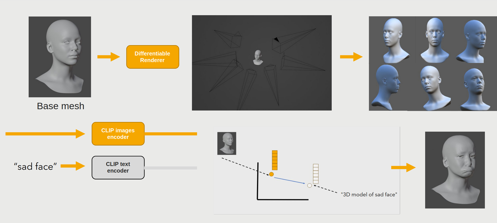

<div style="text-align:center;">
    
</div>

#  Flexigon: Semantic Mesh Editing Across Scales with Topology Preservation

Flexigon is a research-driven system integrated with Blender for semantic style editing of 3D meshes using text prompts. 
It translates textual descriptions into controlled shape deformations, allowing intuitive and precise modification of 3D geometry directly within Blender 
while preserving mesh topology and smoothness using spectral and variational methods.

Inspired by Sobolev preconditioning, spectral operators, and heat-based regularization, Flexigon performs stable multi-resolution mesh deformations that preserve topology and geometric details:

[transformation_all.webm](https://github.com/user-attachments/assets/3e42a33c-9124-4459-b538-1bbf930c754c)

By starting with different base meshes, Flexigon preserves the original structure while adapting to the deformation guidance: for example, using a cartoon mesh as input will ensure that the deformation follows the prompt but maintains the cartoonish style:

[transformation_cartoon.webm](https://github.com/user-attachments/assets/1318de8c-f9d0-457f-8c28-6cf1fd5f4904)


---

## Table of Contents

- [System Requirements](#system-requirements)
- [Installation](#installation)
- [Download Data](#download-data)
- [Research Motivation](#research-motivation)
- [Core Features](#core-features)
- [Algorithm Overview](#algorithm-overview)
- [Multi Resolution Mesh Editing](#multi-resolution-mesh-editing)
- [Example Workflows](#example-workflows)
  - [Blender Shapekeys](#blender-shapekeys)
  - [Flexigon Parameter Guide](#flexigon-parameter-guide)
  - [Example Results](#example-results)
    - [Character Style Deforming](#character-style-deforming)
    - [Facial Expressions](#facial-expressions)
    - [Cartoon Modeling and Animation](#cartoon-modeling-and-animation)
    - [Multiresolution Results](#multiresolution-results)
    - [Animal-Inspired Style for Human Faces](#animal-inspired-style-for-human-faces)
- [Blender Addon](#blender-addon)
- [Related Work / References](#related-work--references)
- [License](#license)

## System Requirements:

* Python: 3.10 or higher

* GPU: CUDA-compatible recommended (tested with CUDA 11.7)

* CPU: Supported, but slower

## Installation

~~~bash
git clone https://github.com/kfirshem/Flexigon.git
cd Flexigon
pip install -r requirements.txt

# Setup Flexigon in editable mode
pip install -e .
~~~

## Download Data

You can download all files using:

```bash
git clone https://huggingface.co/kfirshemtov/Flexigon data
```


Install Kaolin (which is used for differentiable rendering) from:

https://github.com/NVIDIAGameWorks/kaolin


## Research Motivation

Recent progress in text-conditioned generative models has made it possible to describe shape intent semantically, but connecting that intent to a continuous, physically meaningful deformation remains an open problem.  

Flexigon explores a formulation where semantic input is translated into differentiable surface displacements, constrained by geometric smoothness and locality priors.  

The system combines:

- Text embedding conditioning that guides deformation magnitude and direction through learned latent cues
- Sobolev-space preconditioning for well-posed gradient flow on irregular meshes  
- Multiresolution editing that propagates deformations consistently across mesh levels
- Heat-equation regularization to ensure smooth deformation fields  

Together these components form a bridge between semantic conditioning and geometry-aware optimization, allowing meaningful, topology-preserving shape transformations directly inside Blender.

---


## Core Features

- Text-driven mesh deformation via semantic embeddings  
- Sobolev-regularized optimization for stable deformation flow  
- Spectral and heat-based smoothing operators  
- Multiresolution editing and consistent surface propagation  
- Full Blender integration with generating shapekeys 
- Modular structure for research and experimentation  

---

## Algorithm Overview




* The algorithm takes a base mesh and a text prompt as input.
* It performs differentiable rendering from multiple viewpoints to generate a set of images.
* These rendered images are passed through a CLIP model, which extracts a latent representation.
* The latent vector of the rendered images is compared to that of the text prompt, and the mesh geometry is optimized so that both representations become closer in the CLIP embedding space.
* This process enables text-driven 3D mesh deformation guided by semantic alignment between visual appearance and textual description.
* Since the optimization process is inherently noisy, the resulting geometry can become distorted.
* To address this, regularization is required. However, simple smoothing regularization often degrades fine geometric details and shape integrity.
* To overcome this limitation, this work draws inspiration from Sobolev preconditioning, a common technique in digital geometry processing.
* The key innovation of this project is the multi-resolution approach, which allows intuitive control over the deformation scale - enabling styles that range from coarse caricature-like exaggerations to fine, photorealistic adjustments.


## Multi Resolution Mesh Editing


## Example Workflows

Navigate to the module directory:

```bash
cd flexigon/magic_shape_keys
```

You can run the script with a specific configuration file:

```bash
python magic_shapekeys_multires.py --config_path configs/config_multires_mid_scale.yaml
```
The script will load the configuration you specify.
Since the prompt parameter is likely the one you'll change most often, you can override it directly from the command line:

```bash
python magic_shapekeys_multires.py --config_path configs/config_multires_mid_scale.yaml --prompt "3D model photorealistic portrait of Ogre"
```

The results will be stored in Flexigon/results/<output_folder_name> where `<output_folder_name>` is specified in the configuration file.

To process multiple prompts sequentially, use a JSON file containing a list or dictionary of prompts:
```bash
python magic_shapekeys_multires.py --config_path configs/config_multires_low_scale.yaml --prompts_dict prompts_dict/list.json
```

The results will be stored in Flexigon/results/<dict_name> where `<dict_name>` corresponds to an entry in `list.json`.
For example, if `list.json` contains `"example"`, the results will be saved in:

The results will be saved in <output_path> where the default is directed to results/<running_name>.
Each has id folder, inside you'll see the saved config, rendered images and .obj each `reinit_opt_every` iterations.

### Running examples

##### Human Base Mesh 

##### High Scale

```bash
python magic_shapekeys_multires.py --config_path configs/config_multires_high_scale.yaml --prompt "3D model of young baby orangutan" --step_size 0.0003 --num_of_iterations 9001
```

```bash
python magic_shapekeys_multires.py --config_path configs/config_multires_high_scale.yaml --prompt "3D model of old man with widely open eyes"
```

##### Mid Scale 

```bash
python magic_shapekeys_multires.py --config_path configs/config_multires_mid_scale.yaml --prompt "3D model of female green goblin"
```

```bash
python magic_shapekeys_multires.py --config_path configs/config_multires_mid_scale.yaml --prompt "3D model photorealistic portrait of sly imp with widely open eyes" --mesh_scale_factor 1.0
```

```bash
python magic_shapekeys_multires.py --config_path configs/config_multires_mid_scale.yaml --prompt "3D model photorealistic portrait of kingpin with widely open eyes"
```

```bash
python magic_shapekeys_multires.py --config_path configs/config_multires_mid_scale.yaml --prompt "3D model of miles morales with widely open eyes" --step_size 0.0003
```

```bash
python magic_shapekeys_multires.py --config_path configs/config_multires_mid_scale.yaml --prompt "3D model of ogre with widely open eyes" --step_size 0.0003
```

```bash
python magic_shapekeys_multires.py --config_path configs/config_multires_mid_scale.yaml --prompt "3D model of Mulan with widely open eyes"
```

##### Low Scale

```bash
python magic_shapekeys_multires.py --config_path configs/config_multires_low_scale.yaml --prompt "3D model of blobfish expression"
```

```bash
python magic_shapekeys_multires.py --config_path configs/config_multires_low_scale.yaml --prompt "3D model of face with surprised face with open mouth" --mesh_scale_factor 1.1 --num_of_iterations 6001
```

###### Example for fast optimization

Large step size, small number of iterations.

```bash
python magic_shapekeys_multires.py --config_path configs/config_multires_high_scale.yaml --prompt "3D model of ogre with widely open eyes" --step_size 0.005 --num_of_iterations 1201
```

Be careful with this configuration since the optimization might be unstable. The recommended configuration is using smaller step size with longer number of iterations.

##### Cartoon Base Mesh

```bash
python magic_shapekeys_multires.py --config_path configs/config_multires_cartoon.yaml --prompt "3D model of cute alien"
```

```bash
python magic_shapekeys_multires.py --config_path configs/config_multires_cartoon.yaml --prompt "3D model of ogre"
```

## Blender Shapekeys

After the optimization, the script creates shape keys in Blender and generates the Blender files:

* `mesh_evolution_all.blend` - 
   Animation of the mesh evolution throughout the optimization process.

* `mesh_top_k.blend` - 
   Contains the top K meshes that best represent the variance in the dataset.  
   This allows flexibility to choose and fine-tune the mesh according to the artist's needs.

* `mesh_top_k_incremental.blend` - 
   contains the same top K meshes but with incremental shape keys, where each shape key is relative to the previous one and represents the delta deformation. This allows the artist to adjust different “features” independently, for example face width, nose, ears, etc., giving fine-grained control over the intensity of each deformation.

In Blender, you’ll see the shapekeys along with their corresponding iteration numbers:


The recommended usage is the incremental, since it allows editing with the incremental changes over the optimization which changes different features of the mesh.


If you want to create shapekey from the folder separately, you can use the script:

```
from flexigon.facial_shapekeys.create_shapekeys_from_flexigon import CreateBlenderShapekeys

# set you output path
folder_path = './'
create_blender_shapekeys = CreateBlenderShapekeys(folder_path)
create_blender_shapekeys()

```
By default, the .blend file will be saved to the same folder, however, you can set it to other folder

#### Class Initialization (`__init__`)

| Parameter       | Type | Default        | Description                                      |
|-----------------|------|----------------|------------------------------------------------|
| `input_folder`  | str  | —              | Path to the folder containing OBJ files.      |
| `output_folder` | str  | `input_folder` | Path to save generated Blender files. Optional; defaults to `input_folder`. |

#### Running the Pipeline (`__call__`)

| Parameter      | Type | Default | Description |
|----------------|------|---------|-------------|
| `start_frame`  | int  | 0       | First frame of the animation. |
| `end_frame`    | int  | 250     | Last frame of the animation. |
| `topk`         | int  | 5       | Number of top meshes to select for `mesh_top{topk}.blend` that best represent dataset variance. |


This is useful if you want to view intermediate results before the optimization is complete,
or if you want to create a .blend file with different parameters.

The output generates a **shapekey** in Blender, giving you control to adjust the strength of the deformation, either reducing or enhancing its effect:

<video src="https://github.com/user-attachments/assets/ea985c4e-a7f6-4eea-92c3-c923acfda774" controls height="240"></video>  

Since the topology is preserved, you can mix different shapekeys:

<video src="https://github.com/user-attachments/assets/890ee02b-63eb-420f-a667-94563933e130" controls height="240"></video>  

You can edit a specific region:

<video src="https://github.com/user-attachments/assets/806da3c3-5cf1-4d45-b028-ec1d6018b8ad" controls height="240"></video>  

Or subtract a region:

<video src="https://github.com/user-attachments/assets/7dc6b0cc-405d-4669-b510-ab00afe82180" controls height="240"></video>

Example of incremental editing you can find here:

<video src="https://github.com/user-attachments/assets/99c10f43-782b-4d16-acc9-c6914abcf455" controls height="240"></video>  


#### Flexigon Parameter Guide

| Parameter                 | Description                                                                                                                                                                                                                                                                                                                                                                                                                        |
|---------------------------|------------------------------------------------------------------------------------------------------------------------------------------------------------------------------------------------------------------------------------------------------------------------------------------------------------------------------------------------------------------------------------------------------------------------------------|
| `face_path`               | Path to the mesh to be edited. Example base meshes, including the cartoon base, are provided (from [Blender Asset Bundles](https://developer.blender.org/docs/release_notes/4.0/asset_bundles/)). **Note:** These models are under CC-BY-SA 4.0 license; please retain the license if redistributing or modifying.                                                                                                                 |
| `prompt`                  | Text prompt guiding mesh editing. Recommended Prompt Prefix: `"3D model photorealistic portrait of ..."`. You are invited to experiment with other combinations to explore different styles and variations.                                                                                                                                                                                                                        |
| `negative_prompt`         | Text prompt specifying elements to avoid. Helps steer results away from unwanted features. Example negative prompts are provided in the config files. Feel free to experiment to refine the output.                                                                                                                                                                                                                                |
| `num_of_iterations`       | Number of optimization iterations. Higher values allow finer convergence and more detailed results; lower values produce faster but coarser results.                                                                                                                                                                                                                                                                               |
| `reinit_opt_every`        | Reinitialize the optimizer and save intermediate results every N iterations. This helps stabilize optimization and allows inspection of progress at regular intervals.                                                                                                                                                                                                                                                             |
| `step_size`               | Controls the speed of the deformation process. High values may produce exaggerated offsets or unstable results, while low values slow down convergence but ensure smoother updates.                                                                                                                                                                                                                                                |
| `lambda_reg`              | Sobolev smoothness weight for deformation. Higher values produce smoother overall results, while lower values allow sharper, more detailed features.                                                                                                                                                                                                                                                                               |
| `lambda_sym`              | Weight of the symmetry loss. Higher values enforce stronger symmetry in the deformation, while lower values allow more asymmetric variations.                                                                                                                                                                                                                                                                                      |
| `decimate_ratio`          | Mesh decimation ratio for multi-resolution editing. Lower ratios emphasize coarse/global features, while higher ratios preserve fine/high-frequency details. The final mesh is upsampled back to the original resolution.                                                                                                                                                                                                          |
| `res_levels`              | Number of decimation steps. For example, a value of 2 means two decimation steps using the specified `decimate_ratio`. The idea is to build a multi-resolution pyramid allowing optimization at different scales. Currently, only the lowest scale is optimized, so a res_level of 1 is enough, though the code can be adapted to work with multiple resolutions                                                                   |
| `deform_length_t_ratio_h` | Constrains the maximum deformation length relative to the vertex displacement standard deviation, stabilizing convergence and preventing exaggerated features during optimization. Lower values reduce extreme deformations, higher values allow larger steps.                                                                                                                                                                     |
| `a_willmore`              | Balances between Willmore flow and heat (Laplacian) flow in the Sobolev regularization. A value of 0 uses pure heat flow (balanced smoothing with detail preservation), while higher values emphasize Willmore flow (stronger curvature-based smoothing). For example, 0.1 → mostly heat flow, 0.9 → mostly Willmore flow. Useful for controlling the trade-off between natural smoothness and stylized, exaggerated deformations. |
| `mesh_scale_factor`       | Set the size of the mesh in rendering |                                                                                                                                                                                                                                                                                                                                                                                             |

## Example Results

The following meshes were generated with Flexigon and rendered in Blender, accompanied by UV and environment maps.

### Character Style Deforming

| Text Prompt     | Output                                                                                              |
|-----------------|-----------------------------------------------------------------------------------------------------|
| “Alien”         |              |
| “Orc”           |                  |
| “Kingpin”       |                    |
| “Female Goblin” |  |

### Facial Expressions

<p align="center">
  
  
  

  
</p>

### Cartoon Modeling and Animation
Perform expressive, exaggerative edits using continuous deformation fields with controllable smoothness.

<video src="https://github.com/user-attachments/assets/b0e1d7d5-3e67-46d7-9270-84f249777b65" controls height="240"></video>

### Multiresolution Results

Two different meshes generated with the prompt "orc" by optimizing at different resolution levels:

* One emphasizes coarse features, the other emphasizes fine details.

* Both meshes share the same topology, allowing for combinations or mixed variants between them.

<div style="text-align:center;">
    
</div>

### Animal-Inspired Style for Human Faces
Experiment with creative animal inspired style


## Blender Addon
Coming in a future release.

---

## Related Work / References

This project builds upon and draws inspiration from several key works in geometry processing and differentiable rendering:

- **Nicolet, B., Jacobson, A., & Jakob, W. (2021).** "Large Steps in Inverse Rendering of Geometry."  
Acknowledgment is given for the reuse of certain functions from this work's implementation
[GitHub Repository](https://github.com/rgl-epfl/large-steps-pytorch)


- **Michel, O., Bar-On, R., Liu, R., Benaim, S., & Hanocka, R. (2022).** "Text2Mesh: Text-Driven Neural Stylization for Meshes."  
  [GitHub Repository](https://github.com/threedle/text2mesh)

- **Yu, C., et al. (2021).** "Repulsive Surfaces."  
  [Project Page](https://www.cs.cmu.edu/~kmcrane/Projects/RepulsiveSurfaces/index.html)

- **Sharp, N.** "robust-laplacians-py."  
  [GitHub Repository](https://github.com/nmwsharp/robust-laplacians-py)

- **Botsch, M., & Kobbelt, L. (2004).** "A Remeshing Approach to Multiresolution Modeling."  
  [PDF](https://www.graphics.rwth-aachen.de/media/papers/remeshing1.pdf)

- **Crane, K.** "Conformal Willmore Flow."  
  [Project Page](https://www.cs.cmu.edu/~kmcrane/Projects/ConformalWillmoreFlow)

These works inspired the **regularization approach** and some multi-resolution strategies used in this project.

## License

Flexigon is an experimental framework intended for personal projects and research purposes.
If you use this code or build upon it, please acknowledge the Flexigon project.

The provided human base meshes were taken from: https://developer.blender.org/docs/release_notes/4.0/asset_bundles/ 
and are under the CC-BY-SA 4.0 license. Please retain this license if you redistribute or modify them.
